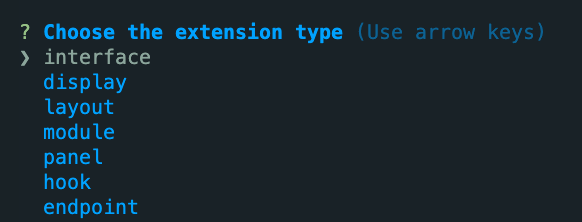

# DBMS Final Project
## Quick Start
```bash
yarn create directus-project [project-name]
cd [project-name]
npx directus start
```

### Create custom endpoint
- 1. Going away of your directus project, and run below shell to create your extension for directus.
    ```bash
    yarn create directus-extension
    ```
- 2. Choose `endpoint`

    
- 3. After created your extension project, your can modify the `[extension-proj]`'s  `index.js` file to customize your endpoint function.
- 4. Build the extension by run below shell inside the `[extension-proj]` directory:
    ```bash
    yarn build
    ```
- 5. Copy your builed file (`/dist/index.js`) to the directus project's `extenstions` folder
- 6. Run `npx directus start` to test your custom endpoint.
- 7. `localhost:8055` Done!


## Error handle
- Check your node version
    ```
    npx directus init
    ```
- `npm start` doesn't actually install / migrate the database. It just starts the server. You can use `npx directus init` to install the DB

## Reference
1. https://stackoverflow.com/questions/72380698/how-to-create-and-deploy-an-endpoint-with-directus
2. https://github.com/directus/directus/discussions/3312
