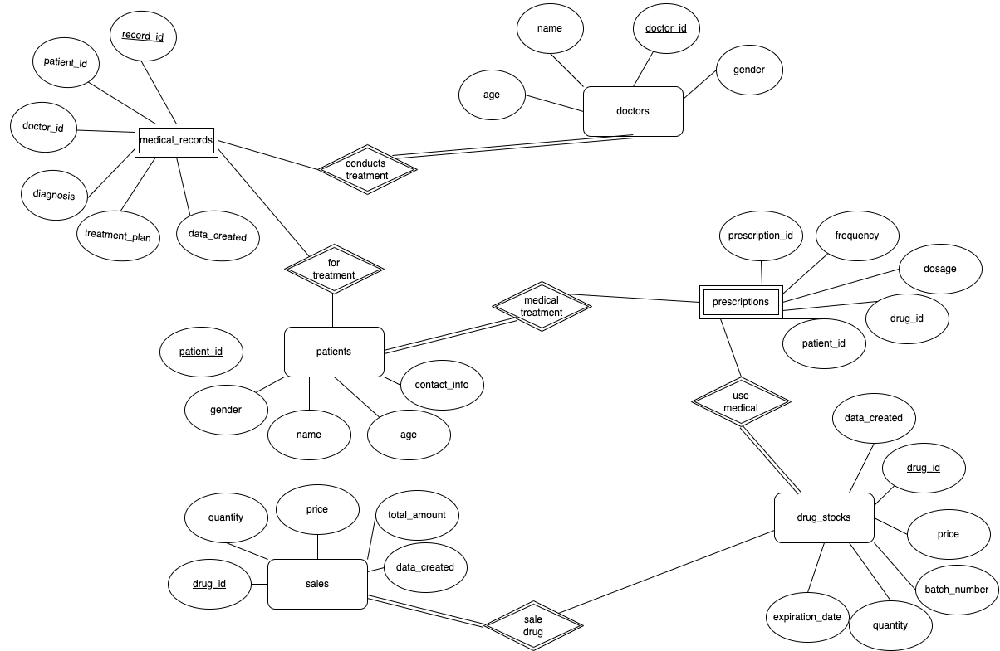
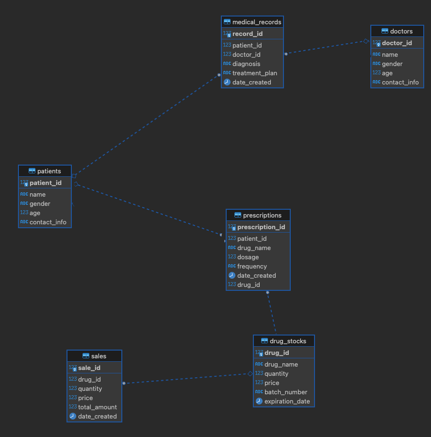

# DBMS Final Project
姓名 葉家任
學號 VS6102093
## Quick Start
```bash
docker compose up -d
cd frontend
yarn start
```
> **Warning**
> Please make sure you rename the environment file from `.env.example`  to `.env`

## Schema Introduction
我跟朋友期望能夠以AI與資訊科技來進軍醫療產業，正好透過這堂課程，
嘗試進行一個小小的處方籤管理系統，用於管理醫療處方籤的資料和流程。
它能記錄每位病人的處方籤資料，包括藥品名稱、劑量、服用頻率等。還能追蹤處方籤的狀態。
處方籤管理系統還能與藥品庫存系統集成，自動更新庫存資料並提醒藥品需要補貨。
透過這種軟體可以改善醫療流程效率，確保病人能按時接受正確的治療，並進而幫助藥師服務病患。

### Demand Analysis
建立病患處方籤管理系統，需要考慮以下幾個因素：
- 病患基本資料表，包含病患的姓名、性別、年齡、聯絡方式等資料。
- 醫生基本資料表，包含醫生的姓名、性別、年齡、聯絡方式等資料。
- 病歷表，記錄病患的病史、診斷、治療方案等資料。
- 處方籤表，記錄病患的處方資料，包括處方藥品名稱、用量、用法、服藥次數等。
- 藥品庫存表，記錄藥品的庫存量、單價、批號、有效日期等資料。

功能方面，病患處方籤管理系統可以提供以下功能：
- 病患資料管理CRUD
- 藥師資料管理CRUD
- 病歷管理CRUD
- 處方籤管理CRUD
- 藥品庫存管理CRUD
- 處方籤打印(?)：可以將病患的處方資料打印成處方籤，方便病患到藥房領藥。
- 藥品銷售管理：可以記錄藥品的銷售情況，包括銷售數量、單價、總金額等。
- 統計報表：可以生成各種統計報表，例如病患數量、處方數量、藥品銷售金額等。
- 安全性：系統需要提供足夠的安全措施，防止資料被竄改或泄露。(這邊用Directus處理)

### 關聯性
- 二元關係：
  - 藥品銷售：必定會有藥品
- 三元關係：
  - 病歷管理(medical_record): 必定有醫生與病患
  - 處方籤管理(prescriptions): 必定有患者與藥品

### Database Schema
```sql=
CREATE TABLE patients (
  patient_id SERIAL PRIMARY KEY,
  name TEXT NOT NULL,
  gender CHAR(1) NOT NULL,
  age INTEGER NOT NULL,
  contact_info TEXT
);

CREATE TABLE doctors (
  doctor_id SERIAL PRIMARY KEY,
  name TEXT NOT NULL,
  gender CHAR(1) NOT NULL,
  age INTEGER NOT NULL,
  contact_info TEXT
);

CREATE TABLE medical_records (
  record_id SERIAL PRIMARY KEY,
  patient_id INTEGER REFERENCES patients (patient_id),
  doctor_id INTEGER REFERENCES doctors (doctor_id),
  diagnosis TEXT NOT NULL,
  treatment_plan TEXT NOT NULL,
  date_created TIMESTAMP WITH TIME ZONE DEFAULT CURRENT_TIMESTAMP
);

CREATE TABLE prescriptions (
  prescription_id SERIAL PRIMARY KEY,
  patient_id INTEGER REFERENCES patients (patient_id),
  drug_id INTEGER REFERENCES drug_stocks (drug_id),
  dosage REAL NOT NULL,
  frequency TEXT NOT NULL,
  date_created TIMESTAMP WITH TIME ZONE DEFAULT CURRENT_TIMESTAMP
);

CREATE TABLE drug_stocks (
  drug_id SERIAL PRIMARY KEY,
  drug_name TEXT NOT NULL,
  quantity INTEGER NOT NULL,
  price REAL NOT NULL,
  batch_number TEXT NOT NULL,
  expiration_date DATE NOT NULL
);

CREATE TABLE sales (
  sale_id SERIAL PRIMARY KEY,
  drug_id INTEGER REFERENCES drug_stocks (drug_id),
  quantity INTEGER NOT NULL,
  price REAL NOT NULL,
  total_amount REAL NOT NULL,
  date_created TIMESTAMP WITH TIME ZONE DEFAULT CURRENT_TIMESTAMP
);
```
- patients 表格記錄病患的基本資料，包括病患 ID、姓名、性別、年齡、聯絡方式等。
- doctors 表格記錄醫生的基本資料，包括醫生 ID、姓名、性別、年齡、聯絡方式等。
- medical_records 表格記錄病歷資料，包括病歷 ID、病患 ID、藥師 ID (?) 、 醫生 ID (?)
- prescriptions 表格記錄處方資料，包括處方 ID、病患 ID、醫生 ID、藥品名稱、用量、用法、建立日期等。
- drug_stocks 表格記錄藥品庫存資料，包括藥品 ID、藥品名稱、數量、單價、批號、有效日期等。
- sales 表格記錄藥品銷售資料，包括銷售 ID、藥品 ID、數量、單價、總金額、建立日期等。

## EM Model


## Relation Schema

## Backup data from postgreDB
```bash
docker exec -it dbms-database-1 pg_dump -n public -U postgres directus  > backup.sql 
```

